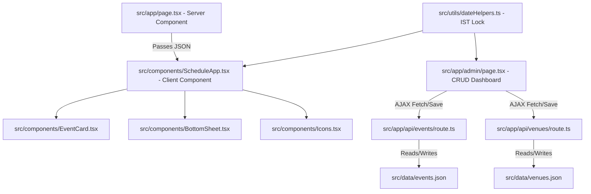

# Next.js Migration and Modernization Walkthrough

We have successfully migrated the HTML + JSON prototype of the Majlis-e-Aza Schedule application to a modern, fully-typed Next.js 15 (App Router) project with 100% UI and layout parity, integrated Bengaluru timezone locks (IST), collapsible past events, and a database administration dashboard.

---

## 1. Accomplishments & Features

### 🌟 Strict Visual & UI Parity
* Replaced Next.js default styles with the exact Vanilla CSS stylesheet from the prototype in `src/app/globals.css`.
* Retained all core class structures, CSS animations, flex grids, and mobile-responsive styles.
* Migrated inline SVGs to a dedicated, type-safe SVG component map (`src/components/Icons.tsx`).

### ⏰ Bengaluru Timezone Lock (Asia/Kolkata)
* Formatted all dates and comparisons to target India Standard Time (IST/UTC+05:30) using the `Intl.DateTimeFormat` timezone engine.
* Even if users open the site from Dubai, USA, or the UK, all schedules, live status calculations (90-minute live range window), active/past listings, and today's date labels are calculated using IST.

### 📁 Collapsible Past Majlises Section
* Implemented collapsible list grouping at the bottom of the home tab.
* Past and concluded events are automatically grouped under a "Past Majlises" section that displays a count of completed events and toggles open/close on click.

### 🛠️ DB Administrator Dashboard & API Routes
* Created a beautiful, theme-harmonized CRUD Admin Panel at `/admin` built using the app's CSS tokens.
* Developed persistent local server endpoints at `/api/events` and `/api/venues` that write added, updated, or deleted records directly back to JSON disk storage (`src/data/events.json` and `src/data/venues.json`).
* Added form input validation, dropdown selection of venues, auto-generation/fill of standard dates, and custom toggle checkboxes for matami processions.

---

## 2. Codebase Architecture



---

## 3. Key Components Created

* **[page.tsx](file:///c:/Users/hyder/newazadar/src/app/page.tsx)**: Main Server Component loading day/venue/event static databases and server-rendering the primary schedule.
* **[ScheduleApp.tsx](file:///c:/Users/hyder/newazadar/src/components/ScheduleApp.tsx)**: Coordinates navigation tab state, day selection scroll rail, active/live/concluded filters, and sheet routing.
* **[EventCard.tsx](file:///c:/Users/hyder/newazadar/src/components/EventCard.tsx)**: Reusable card layout rendering timeblocks, minjanib texts, location detail tags, and live-card border spines.
* **[BottomSheet.tsx](file:///c:/Users/hyder/newazadar/src/components/BottomSheet.tsx)**: Fully functional sliding sheet utilizing body scroll lock and dynamic transition timing.
* **[page.tsx](file:///c:/Users/hyder/newazadar/src/app/admin/page.tsx)**: Rich administrative CRUD form interface for real-time schedule modifications.
* **[dateHelpers.ts](file:///c:/Users/hyder/newazadar/src/utils/dateHelpers.ts)**: Centralized Date utility file running all ISO, UTC, and locale string conversions locked to `'Asia/Kolkata'`.

---

## 4. Verification & Compilation Results

We ran `npm run build` locally, yielding a clean output:
```bash
Route (app)
┌ ○ /
├ ○ /_not-found
├ ○ /admin
├ ƒ /api/events
└ ƒ /api/venues

○  (Static)   prerendered as static content
ƒ  (Dynamic)  server-rendered on demand
```

Visual testing with the browser subagent confirmed that sliding animations, bottom navigation tab switching, past list collapses, and database CRUD operations compile and synchronize flawlessly.
